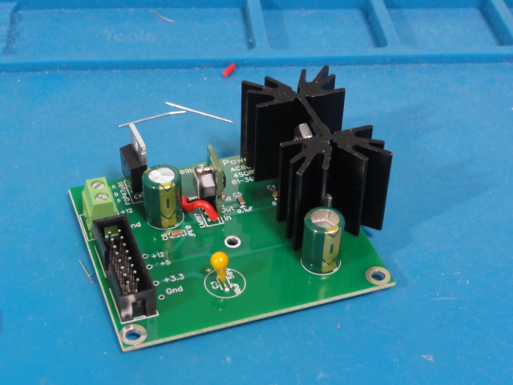
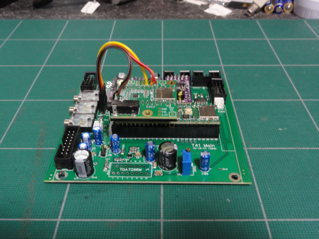
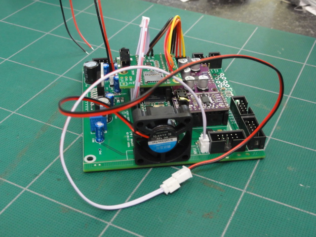
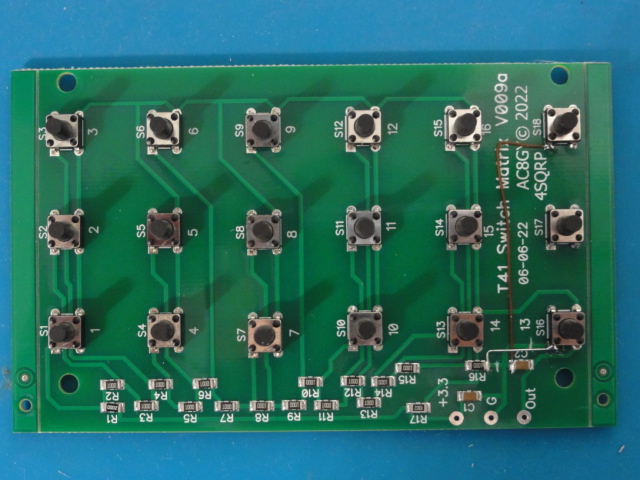
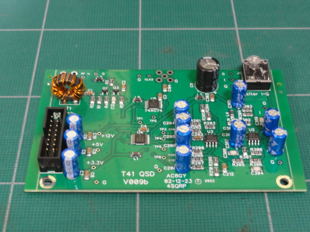
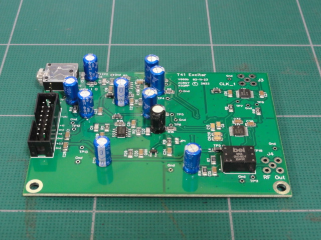
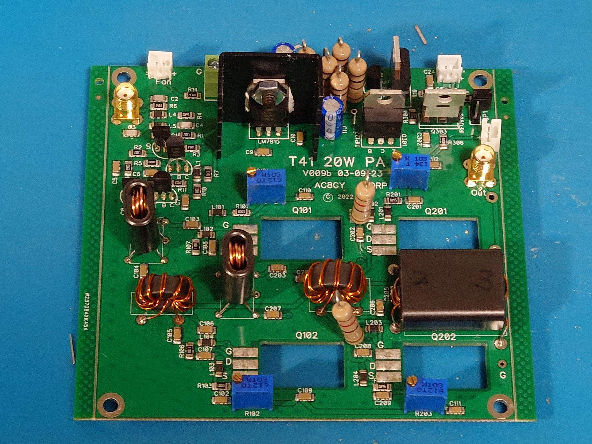
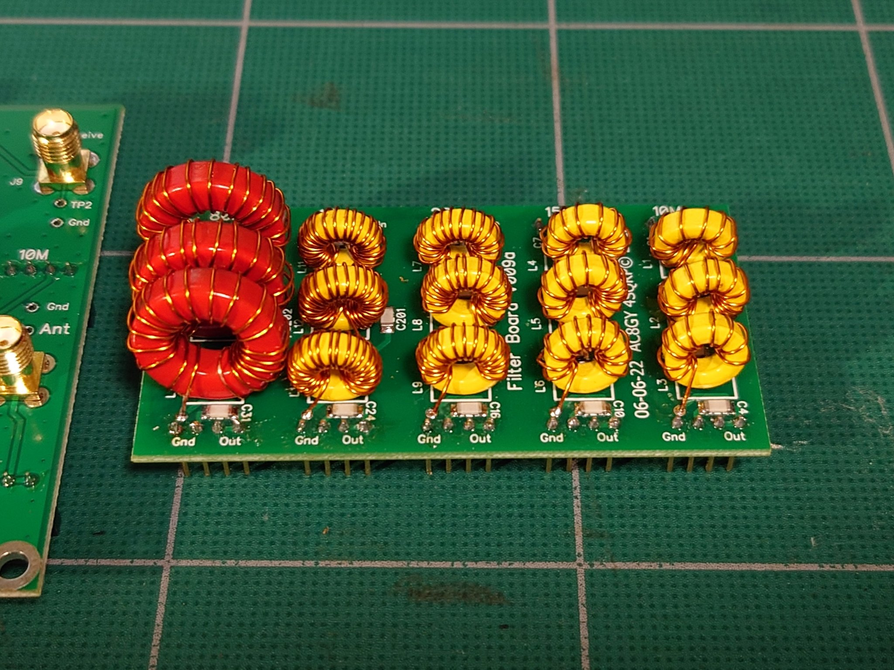
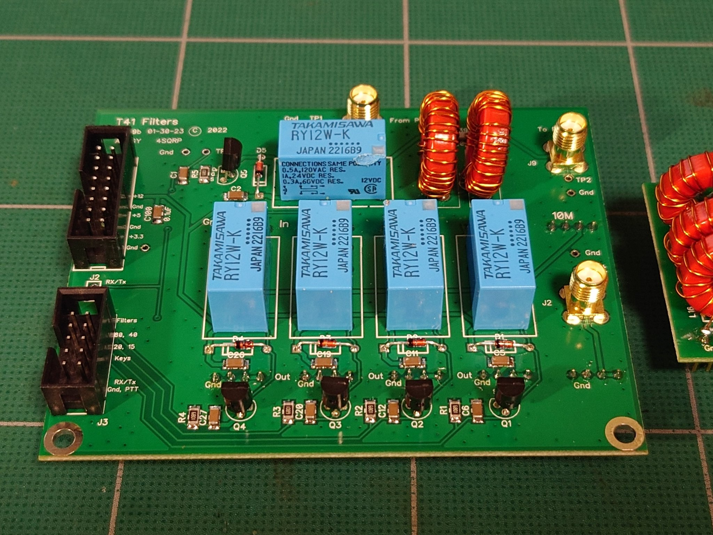

Here are my memo for assembling T41 EP software defined transceiver in Japanese.

Each chapter of the published assembly manual is translated line by line from English to Japanese.
Replaced Word files with PDF files.

Power Supply

MAIN Board

Encoder Boards and Switch Matrix

QSD Receive Board, Rev A

Exciter Board

20W PA board

Filter Daughter Board

Filter and Relay Boards

